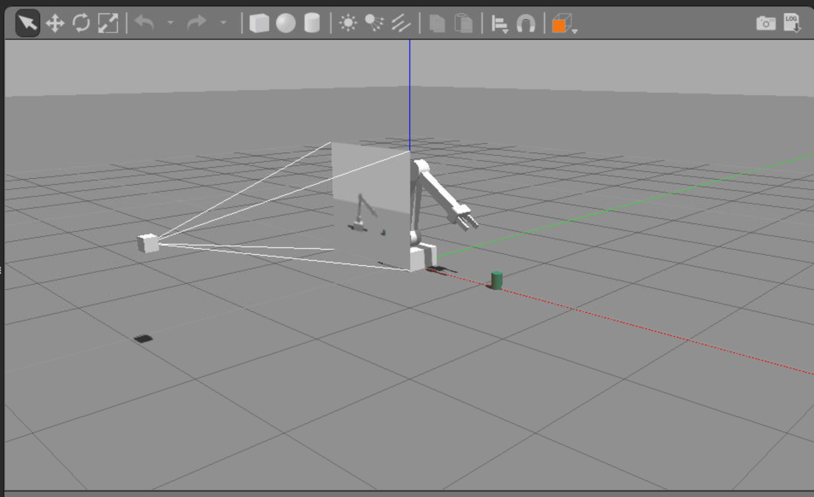

# Deep RL Arm Manipulation
This project is based on the Nvidia open source project "jetson-reinforcement" developed by [Dustin Franklin](https://github.com/dusty-nv). The goal of the project is to create a DQN agent and define reward functions to teach a robotic arm to carry out two primary objectives:

1. Have any part of the robot arm touch the object of interest, with at least a 90% accuracy.

2. Have only the gripper base of the robot arm touch the object, with at least a 80% accuracy.

----

This is a screenshot of the simulator:

These are screenshots of the network achieving the required accuracy for objective 1:

and objective 2:

